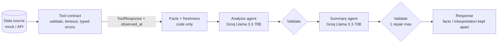

# AI Stock Analyser

A multi-agent stock-analysis service built on **Agno**, running **Llama 3.3 70B on Groq**. Routing is done in code, every tool has a strict contract, every piece of data carries its observation timestamp, and every sentence the model writes must cite the facts it came from.

> The bundled data source is a **fictional mock dataset** (`tools/data/mock_market_data.json`). Its prices and announcements are made up. Do not use them for investment decisions.

## Architecture

```
                         POST /analyze {symbol, question, date?, period}
                                           |
                                           v
+--------------------------------- Orchestrator (code-routed) --------------------------------+
|                                                                                             |
|  1. fetch_data     Data agent ---> ToolExecutor ---> tool ---> provider (mock | real API)    |
|                                    (retries,         (validate input, timeout,              |
|                                     budget, ledger)   validate payload, typed errors)       |
|                                           |                                                  |
|                                           v  ToolResponse{data, source, observed_at}        |
|  2. build_facts    reported facts (P*, N*) + metrics computed by code (C*)                   |
|  3. freshness      staleness per dataset + timestamp skew across datasets  -> notice/flags   |
|  4. analyze        Analysis agent (Groq)       -> signals, each citing fact ids              |
|  5. validate       citations resolve? numbers grounded?  -> drop / auto-cite                 |
|  6. summarize      Summary agent (Groq)        -> headline + cited claims                    |
|  7. validate       same checks, ONE repair round with feedback, then drop what still fails   |
|  8. finalize       confidence capped by data-quality policy                                  |
|  9. render         code-built report: notice | flags | interpretation | facts | sources      |
+---------------------------------------------------------------------------------------------+
                                           |
                                           v
                  AnalyzeResponse (answer, facts, freshness, flags, sources, trace, ledger)
```

In short: **data source -> tool call -> agent -> validation -> response.**



### Why the routing lives in code

Agno offers model-led coordination through `Team`. This project doesn't use it. `agents/orchestrator.py` runs a fixed sequence of stages instead. Each stage is recorded in `response.trace` with its status, its duration and, when it's skipped, the stop condition that caused the skip. The LLM decides what the data means. It never decides what runs next.

The data agent defaults to a **deterministic** plan (quote, history and announcements, fetched in parallel). With `DATA_AGENT_MODE=llm`, an Agno tool-calling agent plans the calls instead. It is still bounded:

- It goes through the same executor and call budget.
- Calls for any other symbol are refused.
- Results with arguments that don't match the plan are ignored.
- Any planned call the model skips is filled in deterministically.

## Tool contract (`tools/`)

| Tool | Input model | Returns |
|---|---|---|
| `get_stock_price(symbol, date=None)` | `StockPriceInput` | `ToolResponse[PriceQuote]` |
| `get_price_history(symbol, period)` | `PriceHistoryInput` | `ToolResponse[PriceHistory]` |
| `get_announcements(symbol, period)` | `AnnouncementsInput` | `ToolResponse[Announcements]` |

Every `ToolResponse` carries `data`, `source` (provider plus a URL or `mock://` id), `observed_at` (when the data was true at the source), `fetched_at` and `query`.

Every tool call goes through the same steps:

1. **Validate input first.** Symbols must match a strict pattern. `period` must be one of 7d/30d/90d/180d/1y. Dates must be real and can't be in the future. If validation fails, the tool raises `InvalidInputError` and the provider is never called.
2. **Enforce a hard timeout.** If the provider doesn't answer in time, the tool raises `ToolTimeoutError`. It never returns `None`.
3. **Map provider failures to distinct errors:**
   - `UnknownSymbolError`: the symbol doesn't exist
   - `DataNotFoundError`: the symbol exists but there's no bar for that date
   - `DataSourceUnavailableError`: outage
4. **Validate the payload.** Checks cover the schema, OHLC consistency, currency, symbol mismatch, naive or future timestamps, and duplicate dates. Any failure raises `MalformedResponseError`.

Retries live one layer up, in `ToolExecutor`:

- At most 3 retries (default 2), with exponential backoff.
- Only timeouts and outages are retried.
- Every attempt counts against `MAX_TOOL_CALLS_PER_REQUEST`, so retries can't be used to get around the cap.

### Data sources

| `DATA_PROVIDER` | What it is |
|---|---|
| `mock` (default) | Fictional dataset with deliberately broken symbols. Used by the tests and the eval. |
| `yahoo` | **Real market data** from Yahoo Finance's public JSON endpoints: daily bars, live last-trade time, and news with links. No API key. Works for any Yahoo ticker (`AAPL`, `RELIANCE.NS`, `BTC-USD`, ...). Set `TOOL_TIMEOUT_SECONDS=8`. |
| `alpha_vantage` | Documented skeleton, not implemented. |

About the Yahoo source:

- The endpoints are unofficial and quotes may be delayed. If the response shape changes, you get `MALFORMED_RESPONSE`. Rate limits (HTTP 429) surface as `SOURCE_UNAVAILABLE`.
- "Announcements" here are news articles about the ticker, not official company filings. Their category says so (`news: <publisher>`).
- Some tickers (many non-US ones, crypto) get no news from Yahoo. The report flags `NO_ANNOUNCEMENTS` and doesn't fill the gap.
- The news feed is observed at fetch time. Over a weekend, Friday's closing prices are more than 24 h older than the news, so a `TIMESTAMP_DISCREPANCY` notice is expected.
- `yfinance` isn't used. It needs pandas, whose DLLs are blocked on some locked-down Windows machines, so this provider calls the endpoints directly with `httpx`.

**Which stocks exist** comes from the official lists, not from code. No ticker is typed in by hand
(`tools/providers/listings.py`, `core/universes.py`). Prices still come from the market provider.

| List | Source | Used for |
|---|---|---|
| Every NSE stock (~2,600) and ETF (~350) | nsearchives.nseindia.com | Search |
| Every active BSE company (~5,000, about 2,600 of them not on NSE), with BSE scrip code and market cap | api.bseindia.com | Search (incl. by 6-digit BSE code); *BSE top 100 / 500*, *BSE-only top 100*; the NSE / BSE switch |
| Nifty 50, Next 50, Midcap 150, Smallcap 250, Nifty 500 and 16 sector indices | niftyindices.com | Screener and Explore |
| Every US-listed stock (~7,000), with market cap and sector | api.nasdaq.com | Search; *US top 100 / 500* and *US <sector>* (top 50 by market cap) |
| Nasdaq-100 | api.nasdaq.com | Screener and Explore |
| Top coins by market cap, without stablecoins or wrapped copies | Yahoo | Search; *Top crypto* |

How the lists are handled:

- **Downloads:** in the background on first use.
- **Caching:** stored in `data/listings/` and refreshed weekly.
- **When a source is down:** the last good copy is used.
- **Bad responses:** an error page never overwrites a list.
- **Not included:** S&P 500 (licensed), so the US lists are ranked by market cap instead. BSE's official index members (Sensex etc.) aren't downloadable, so the BSE lists are ranked by market cap too.
- **BSE requests** must look like they come from bseindia.com (Origin, Referer and Accept-Language headers), or BSE answers "Access Denied".
- **Scan size:** each scan is capped at 500 names.
- **Refresh rate:** Explore refreshes a big list less often (500 stocks about every 4 minutes) to stay under Yahoo's rate limits.
- **Ticker format:** symbols accept the real NSE forms, such as `M&M.NS`, `BAJAJ-AUTO.NS` and `20MICRONS.NS`.

**Mutual funds** come from AMFI, whatever `DATA_PROVIDER` is set to. A `CompositeProvider` sends `MF<scheme code>` symbols (e.g. `MF122639`) to `tools/providers/amfi_provider.py` and everything else to the market provider:

- **Scheme list and latest NAV:** AMFI's `NAVAll.txt`. The parser reads the header row, so it handles both the current 8-column layout and the old 6-column one.
- **All-scheme NAVs on a past date:** AMFI's NAV history report. These drive the category rankings. Weekends are skipped, because a weekend report lists only some funds.
- **Full NAV history of one fund:** mfapi.in, a free mirror of AMFI data.

AMFI uses two naming systems for categories ("Equity Scheme - ELSS" vs "Equity Schemes - ELSS- Tax Saver Fund", "Debt Scheme" vs "Income/Debt Oriented Schemes", and so on). `canonical_category` in `core/mutual_funds.py` maps both onto SEBI's current names, so funds are ranked against their real peers. Index funds are split into Equity, Debt and International/other by what they track.

To add another source, implement the three methods in `tools/providers/base.py` (see `tools/providers/yahoo_provider.py`). Nothing above the provider changes.

## Freshness and grounding

- **Stale data.** A dataset whose `observed_at` is older than `STALE_AFTER_HOURS` gets a `STALE_DATA` flag.
- **Timestamp skew.** If datasets were observed more than `MAX_SKEW_HOURS` apart, code writes a `TIMESTAMP_DISCREPANCY` notice. The notice names both timestamps and is printed verbatim at the top of the report. The model is also told to mention it.
- **Historical requests.** A quote for an explicitly requested past date is marked `historical` and doesn't count as stale.
- **Conflicting sources.** If the quote feed and history feed disagree on the same day's close, both values are kept as facts and a critical `PRICE_SOURCES_DISAGREE` flag is raised. Neither value is picked.
- **Facts vs. interpretation.** The response keeps three kinds of content apart:
  - `reported_facts`: tool data
  - `computed_metrics`: derived by Python, never by the LLM
  - `answer`: `kind: "generated_interpretation"`, written by the model

  The Markdown report puts each one in its own labeled section.
- **Grounding.** Every number in model output must match, allowing for rounding, a number in a *cited* fact:
  - If the number appears in a fact that wasn't cited, that citation is added automatically and the fix is logged.
  - If the number appears in no fact at all, the statement is removed.
  - The summary gets one repair round with specific feedback. After that, anything still failing is dropped and flagged `UNGROUNDED_OUTPUT_REMOVED`.
- **Confidence caps.** Confidence is capped by code: `medium` when there's any data-quality warning, `low` when there's a critical flag.

## Web app: Kairo Markets (`api/static/index.html`)

Open `http://localhost:8000`. The app is a single page with no build step and no frontend framework.

- **Watchlist sidebar:** live prices, change % and sparklines for every symbol. All of it runs over **one** SSE connection (`GET /watchlist/stream?symbols=...`), because browsers allow only about 6 connections per site. Add a symbol from its page; remove one with × on its row. The list is saved in the browser.
- **Symbol search:** press `/` to jump to it.
- **Instrument header:** company name, exchange, live price that flashes on every tick, day change, and the time of the last trade.
- **Overview tab:**
  - live 1D chart, coloured green on rises and red on falls
  - 6M candlestick chart with optional SMA 20/50/200 and Bollinger overlays
  - day stats (open, previous close, high, low, volume, 52-week range, day range)
  - trade tape
- **Outlook tab:** the statistical forecast with its backtest track record, served by the fast LLM-free `GET /forecast/{symbol}`.
- **Research tab:** a cited research note, generated on demand by the multi-agent pipeline (`POST /analyze`).
- **Themes:** dark by default, with a light theme toggle.
- **Mobile:** the layout works on phones.

## Explore home (`api/explore.py`, `core/signals.py`, `static/js/explore.js`)

- **Index strip.** Every page shows NIFTY 50, SENSEX, BANK NIFTY, NIFTY IT, MIDCAP 50, INDIA VIX, S&P 500 and NASDAQ, plus whether NSE is open or closed. It updates live.
- **Market movers.** Five lists: gainers, losers, volume shockers (today's volume against the 20-session average), near the 52-week high, and near the 52-week low. You can view NSE large caps, US mega caps or crypto, and every row has a 1-month sparkline.
  - Each row's data comes from one request (`get_daily_snapshot`).
  - Results refresh every 60 s in a background job. The page shows the last finished result while a refresh runs.
- **Sector heatmap.** Shows each sector's average move, with the number of stocks up and down. Click a tile to filter the movers list.
- **Market breadth.** Advancers against decliners.
- **Your investments.** A summary card fed by your portfolio.
- **Stocks in the news.** Headlines for your holdings, your watchlist and today's biggest movers.
- **Trading screens with a track record.** Eight textbook events: 20-day breakout and breakdown, MACD cross up and down, RSI moving below 30 and above 70, golden cross and death cross. Each one shows:
  - which stocks triggered it in the last 3 sessions;
  - how often, over the last 2 years, the price moved the signalled way 10 sessions later;
  - the base rate for any day and a Wilson interval around the hit rate.

  Most of these screens show no proven edge, and the page says so. Signals are counted once, when the event happens, rather than on every day the condition holds. A test checks that no future bars are used.
- **Command palette (Ctrl+K).** Jumps to any stock, page or action (add a trade, import, new alert, theme).
- **Shared live feed.** The index strip, watchlist and holdings all use one SSE connection, because browsers cap connections per site.
- **Asset versioning.** CSS and JS URLs carry a version, and an import map versions the ES modules. A browser can never mix a new page with stale cached code.

## Platform features

The app has these sections: **Explore · Stocks · Funds · Portfolio · Screener · News · Alerts**. On phones they sit in a bottom tab bar. Portfolio and alerts live in a local SQLite file (`data/kairo.db`, override with `KAIRO_DB_PATH`) and never leave the machine.

### Portfolio (`core/portfolio.py`, `core/finance.py`, `api/portfolio.py`)

- **Adding trades:** manually, or by importing a CSV (`core/importers.py`). Imports accept Zerodha Console tradebooks (equity rows; NSE→`.NS`, BSE→`.BO`) or a simple `date,symbol,side,quantity,price[,fees]` file. You get a preview with per-line errors before anything is saved.
- **Lot matching:** FIFO, the method Indian tax uses. Buy charges are added to cost; sell charges are deducted from proceeds. A sale that exceeds the holdings is flagged, never guessed.
- **Valuation:** live, grouped by currency, with a combined ₹ total converted at today's FX rate. **XIRR** is computed per holding and per currency group, and is checked against Excel's reference value.
- **Live updates:** the holdings table updates tick by tick over the watchlist stream.

### Tax P&L, India (`core/tax_india.py`)

An estimate for a resident individual, for each financial year:

- **Listed shares:** long-term after 12 calendar months. STCG is 15% / LTCG 10% for sales before 23-Jul-2024, then 20% / 12.5%. Long-term gains get a ₹1.25 lakh yearly exemption (₹1 lakh before FY 2024-25).
- **Foreign shares:** long-term after 24 months. Gains are shown in their own currency (Rule 115 conversion is needed before filing).
- **Crypto:** a flat 30%, and losses can't be set off.
- **Set-off:** short-term losses offset any gains; long-term losses only long-term gains. 4% cess is added.
- **Planning:** shows how much of the LTCG exemption is left this year, which holdings carry long-term gains, and which lots turn long-term within 30 days.
- **Not applied (and flagged):** surcharge, the sec 87A rebate, losses carried forward from earlier years, and grandfathering.

This is not tax advice.

### Mutual funds (`core/mutual_funds.py`, `api/funds.py`, `static/js/funds.js`)

- **Funds home:**
  - search across every open-ended scheme;
  - top funds per category for 1Y, 3Y or 5Y returns, Direct or Regular;
  - an SIP / step-up / lumpsum calculator.
- **Fund page:**
  - NAV chart and returns from 1 month up to since inception;
  - **category rank and quartile** with the category median, for 1Y, 3Y and 5Y;
  - risk: volatility, worst fall with its recovery dates, and best and worst calendar years;
  - **rolling returns** for 1, 3 and 5 years: the range, the share of periods that were positive, and the share above 10%;
  - a **real SIP back-test** on actual NAVs, with XIRR;
  - the fund's other plans.
- **Compare:** 2 to 4 funds, with growth of ₹100 from the first date all of them had a NAV.
- **Portfolio:** funds are added as `MF<code>` holdings and valued at the latest NAV.
- **Tax treatment:**
  - equity-oriented funds are taxed like listed shares;
  - debt funds bought on or after 1-Apr-2023 are always taxed at your slab rate (sec 50AA);
  - other funds turn long-term after 24 months and are taxed at 12.5%.
  - The type comes from the AMFI category. Where the category alone doesn't settle it (e.g. FoFs, index funds), the result is marked as inferred.
- **Not shown:** expense ratio, AUM and portfolio holdings. They aren't available as free official data, and the app says so.

### Health check (`core/health.py`)

The health check uses current holdings and one year of prices. It covers:

- holdings count and effective diversification
- the largest position
- sector concentration (via Yahoo profiles)
- volatility, beta and drawdown against NIFTY 50 or the S&P 500
- correlation between holdings
- the share of value below its 200-day average
- deep unrealized losses

The score is 100 minus 20 per issue and 8 per warning, so it's fully traceable.

### Screener, news and alerts (`core/screener.py`, `core/alerts.py`, `api/insights.py`)

- **Screener:** scans NSE large caps, US mega caps, crypto or your watchlist. It shows 1D–1Y returns, RSI, trend against the 50/200-day averages, golden cross, distance from the 52-week high, and volatility. Presets (gainers, momentum, oversold…) and every column filter and sort client-side.
- **News:** merged, de-duplicated headlines for holdings and/or the watchlist, grouped by day. Yahoo's coverage of NSE stocks is thin, and the page says so.
- **Alerts:** price above/below, or day change above/below. A server-side engine evaluates them on every streamed tick, plus periodic snapshots. Each alert fires once, with an in-app toast and an optional desktop notification, and can be re-armed.

## Live price chart (`api/live.py`, `tools/streaming/`)

When you analyse a symbol, the page opens a live panel. It shows the price, the day's change, an intraday chart and a tick tape, all updated as trades happen.

```
Yahoo WebSocket streamer --(protobuf ticks)--> YahooStreamHub (one shared upstream connection)
      --> validate each tick (LiveTick) --> GET /live/{symbol}/stream (Server-Sent Events) --> browser
```

- **First event:** `snapshot`, today's 1-minute path from `get_live_quote`, a contract tool like the others.
- **After that:** a `tick` for every trade Yahoo pushes.
- **Speed:** in testing, stocks ticked about once a second and reached the browser about 2 s after the trade.
- **Malformed frames** are dropped and counted, never shown.
- **Upstream stream down:** the endpoint falls back to polling a snapshot every 5 s. Those events are labelled `source: "poll"` and the badge turns **DELAYED**.
- **Market closed:** the badge shows **MARKET CLOSED** and the chart stays on the last session.
- **Implementation notes:**
  - The streamer frames are decoded by a small pure-Python protobuf reader (`tools/streaming/protobuf_lite.py`).
  - The connection is forced onto IPv4, because IPv6 routes to the streamer hang on some networks.
- **Accuracy:** Yahoo's feed is free and unofficial, and some exchanges delay their quotes. Don't trade off it.

Endpoints:
- `GET /live/{symbol}`: a one-off snapshot.
- `GET /live/{symbol}/stream`: the SSE stream.

## BSE (`tools/providers/bse.py`, `core/universes.py`)

- **Prices:** BSE stocks are priced through Yahoo with the `.BO` ending (RELIANCE.BO), including companies listed only on BSE.
- **NSE / BSE switch:** a company listed on both exchanges (matched by ISIN) gets an NSE | BSE switch on its stock page; each side shows that exchange's own price. `/stocks/venues/{symbol}` returns the pair and the BSE code.
- **Corporate filings:** for every Indian stock (NSE or BSE), the news feed includes the company's official BSE announcements (results, board meetings, allotments, credit ratings, insider trading), each linking to the filed PDF. Their category is `filing: BSE · <type>`, so filings stay distinct from news articles. If BSE is unreachable, the provider's own news is still returned.
- **ETFs:** BSE's equity list also contains ETFs and fund units (ISINs starting `INF`); they're kept out of the company lists.

## In-app article page (`tools/providers/news_reader.py`, `#/news/read`)

Headlines open inside the app, not on the publisher's site.

- **News articles:** the page shows the headline, picture, publisher and time, and the publisher's own short description (the `og:` tags that link previews use). Below come the stocks the story mentions, with live prices, and more news on those stocks. A button opens the full story on the publisher's site.
- **Why not the full text in the app:** Yahoo and BSE forbid framing their pages, and article text is the publishers' copyright. Showing full articles inside the app would need a licensed news feed.
- **BSE filings:** these are public regulatory documents, so the filed PDF is relayed by the server (`/news/filing`) and shown inside the page. It's cached on disk, since a filing never changes.
- **Allowlist:** both fetchers only accept HTTPS addresses on an allowlist (Yahoo article pages; BSE's `xml-data/corpfiling/` PDFs) and refuse redirects that lead elsewhere.

## Terminal (`#/terminal`, `static/js/terminal.js`, `/terminal/bars/{symbol}`)

A full-screen trading chart, modelled on Groww's Terminal. Phase A covers the screen and chart; option chain and trading come next.

- **Chart:**
  - TradingView Lightweight Charts v5.2.1 (Apache-2.0), bundled in `static/vendor/` after checking its npm integrity hash; its licence file is next to it, and the TradingView logo on the chart is the attribution it asks for;
  - smooth zoom and scroll over thousands of candles.
- **Intervals and history:**

  | Interval | History |
  |---|---|
  | 1m | 7 days |
  | 5m / 15m | 60 days |
  | 1h | 2 years |
  | 1D | full listing history |

  Yahoo turns `range=max` into monthly bars, so 1D asks for an explicit window from 1970.
- **Live:** trades from the stock's live stream update the current candle and open the next one when its time window starts.
- **Indicators:**
  - on the price pane: volume, SMA 20/50/200, EMA 20, Bollinger Bands, and intraday VWAP (resets daily);
  - in their own panes: RSI (14) and MACD (12, 26, 9).
- **Drawing tools:** trend line, horizontal line and a measure tool (change, % and bars between two points), saved per stock and interval in the browser. Drawings can be hidden or cleared.
- **Quick ranges:** 1D / 5D / 1M / 3M / 1Y / 5Y / All, each picking a suitable interval.
- **Price scale:** % and log options.
- **Other controls:** screenshot download and full screen.
- **Side panel:** Watchlist with live prices (click to load) and Details (today's numbers, day and 52-week range).
- **Previous close:** Yahoo's intraday `previousClose` can be a session stale for indices (NIFTY 50 showed +0.21% on a −0.76% day). The provider now takes the previous close from the daily candles (one cached request per symbol per day). This also fixes the index strip and stock pages.

### Option chain (`tools/providers/nse.py`, `api/options.py`)

Data comes from nseindia.com. NSE serves JSON only to a browser-like session, so the client first loads the option-chain page for cookies and renews the session once if NSE refuses.

- **Underlyings:** all of NSE's option indices (NIFTY, BANKNIFTY, FINNIFTY, MIDCPNIFTY, …) and every F&O stock, about 210 (`/options/underlyings`). The chain follows the chart: `/options/for/{symbol}` maps ^NSEI to NIFTY and RELIANCE.NS to RELIANCE.
- **Chain** (`/options/chain?symbol=NIFTY&expiry=13-Oct-2026`; the nearest expiry by default). Per strike, for calls and puts:
  - LTP and change;
  - OI and change in OI;
  - volume and IV;
  - best bid and ask with quantities.
- **Summary figures:** spot, at-the-money strike, total call and put OI, PCR, and max pain (the expiry price at which option buyers would be paid the least).
- **Caching:** 5 s while the market is open, 60 s otherwise.
- **Terminal, side panel:**
  - Call LTP | Strike | Put LTP, with OI bars and in-the-money shading;
  - a spot-price marker between the strikes;
  - opens centred on the at-the-money strike.
- **Terminal, full view (expand):** OI, change in OI, volume, IV and LTP for both sides, with PCR, max pain and total OI. On narrow screens an "Option chain" button opens it.
- **Option charts:** clicking a price charts that contract (`OPT:<NSE id>` in the Terminal).
  - Candles at 1m, 5m, 15m and 1h are built from NSE's intraday trades for the day (`/options/contract`), aligned to the 09:15 session start.
  - NSE writes Indian time as if it were UTC, so the times are shifted back 5½ hours.
  - The chart refreshes every 5 s while the market is open.
  - NSE gives no daily history for a contract, so 1D isn't offered for options.

### Trading (`core/trading.py`, `api/trading.py`, `tools/providers/upstox.py`, `static/js/trading.js`)

**Paper trading is on by default.** It needs no setup and uses virtual money (₹10 lakh to start; this can be reset to any amount).

- **What can be traded:** NSE / BSE stocks and NSE options. Indices can't be traded.
- **Order types:** Market, Limit, SL (stop-limit) and SL-M (stop-market), as Buy or Sell, Intraday or Delivery (for options, "carry forward").
- **Fills:**
  - market orders fill at the live price;
  - limit and stop orders are checked every 2 s during market hours by a background loop;
  - orders placed after the close wait for the next session;
  - DAY orders that don't fill expire at 15:30.
- **Margin:** intraday stocks need 20% margin (5×), and short selling is intraday only. Delivery and option buys need the full value.
  Writing (selling) an option you don't hold receives the premium and blocks 15% of the strike value × quantity as margin (a flat stand-in for SPAN margin); buying it back releases the margin.
- **Close of day:** intraday positions are squared off automatically at 15:20 IST.
- **Bookkeeping:** the account (cash, margin, positions, holdings, realised and unrealised P&L) is rebuilt from the list of fills every time, so it can't drift. Fills are recorded once and atomically.
- **Not modelled:** brokerage and taxes, exchange holidays, partial fills, and expiry settlement. Lot sizes come from NSE's `fo_mktlots.csv` in the strategy builder; single-option tickets take a quantity in units.
- **In the Terminal:**
  - Buy and Sell buttons (keys B and S) with a PAPER / LIVE badge;
  - an order ticket showing the order value, margin needed and available funds;
  - the Trade tab: Positions (live P&L, Exit), Orders (Cancel), GTT, Baskets, Holdings and Funds.
- **GTT / OCO** (`/trading/gtt`, paper mode only for now): in the ticket, switch **Regular → GTT**.
  - *Single*: one trigger; when the price crosses it, a market order (or a limit order, if a limit price is set) is placed.
  - *OCO*: a target and a stop-loss on a position. A sell OCO protects a long (stop below target); a buy OCO covers a short (stop above target). The price must sit between the two when it's created. Whichever triggers first places its order; the other is cancelled.
  - GTTs last a year, fire only in market hours, are claimed before the order goes in (so one can't fire twice), and funds are checked when they fire.
- **Baskets** (`/trading/basket`, `/trading/baskets`): **Add to basket** in the ticket collects up to 20 orders; Trade → Baskets places them together, saves them by name, or loads a saved one to edit.
  Each order goes in on its own (a rejection doesn't stop the rest), buy orders first. Live baskets need the same confirmation as single live orders.

**Real trading with Upstox** (free for individual developers) is optional and off until set up:

1. Create an app at account.upstox.com/developer/apps with the redirect URL `http://127.0.0.1:8000/broker/upstox/callback`.
2. Put its key and secret in `.env` as `UPSTOX_API_KEY` and `UPSTOX_API_SECRET`, then restart.
3. In Trade → Funds, click **Connect Upstox** and log in at Upstox. Upstox tokens expire at 03:30 IST, so this is needed once a day.
4. Switch the mode to **Live**.

How live mode behaves:

- **Confirmation:** live orders need a confirmation tick in the ticket, and the API rejects them without `confirm_live: true`.
- **Coverage:** stocks only for now; options need Upstox's instrument list. Orders outside market hours are sent as after-market orders.
- **Endpoints used:** v2 login, v3 place and cancel, and v2 order book, positions, holdings and funds.
- **Testing:** the connector is tested against simulated Upstox responses only. It hasn't been run against a real account.

## Stock research (`api/research.py`, `core/scorecard.py`, `static/js/research.js`)

Every stock page now has:

- **Fundamentals** (`/fundamentals/{symbol}`, Yahoo `quoteSummary`):
  - market cap, P/E and P/B (each next to its industry median);
  - ROE, net and operating margin, debt/equity;
  - EPS, book value per share, dividend yield, revenue growth and beta.
  - Yahoo leaves ROE blank for many Indian stocks, so it's computed as net income ÷ (book value per share × shares). Loss-making companies show "Loss-making" instead of a P/E.
- **Financials:** revenue, net profit, operating profit and net worth for the last 5 quarters or 4 years, as bars with growth labels. These come from Yahoo's fundamentals timeseries, which stays current for small caps (Yahoo's older "earnings" module doesn't).
- **Scorecard** (`/fundamentals/{symbol}/scorecard`): five 0–100 scores against up to 14 industry peers, each with a verdict.

  | Score | Metrics | Better means |
  |---|---|---|
  | Performance | 1-year return | higher |
  | Valuation | P/E, P/B | cheaper |
  | Profitability | ROE, net margin | higher |
  | Growth | revenue and earnings growth | higher |
  | Risk | beta, debt/equity | lower |

  - Each score is a percentile among the stock and its peers. Negative P/E, P/B, beta or debt/equity aren't ranked, and a score needs at least four companies with data.
  - Peers for Indian stocks: same NSE industry (from the Nifty 500 list), closest in BSE market cap. For US stocks: same sector, one line per company.
- **Peers table:** market cap, P/E, P/B, ROE, net margin and 1-year return.
- **Shareholding pattern** (`/shareholding/{symbol}`, NSE filings):
  - promoters, FII, mutual funds, other domestic institutions, and retail and others, for the last 4 quarters, with the change since the previous quarter;
  - the breakdown is read from each filing's XBRL document and cached on disk, since a filing never changes;
  - companies without a promoter group (e.g. HDFC Bank) show 0% promoters.

Fundamentals and scorecards are cached for 6 hours. The first scorecard for a stock takes a few seconds while its peers' figures load.

### Options analytics (`core/options_math.py`, `api/options.py`)

The full option chain in the Terminal has four tabs.

- **Chain**, with a **Prices / Greeks** switch.
  - Greeks (delta, gamma, theta per day, vega per IV point) use Black-Scholes. NSE options are European-style, so it applies.
  - Inputs: NSE's implied volatility, a 6.5% risk-free rate, and time to the 15:30 IST expiry.
  - Where NSE reports IV as 0, the IV is solved from the last price. If that price is below intrinsic value (a stale trade), the Greeks show "—".
  - India VIX is in the chain header.
- **OI analysis:**
  - call and put OI change today, PCR and max pain;
  - open interest and change in OI by strike, with the at-the-money and max-pain strikes marked;
  - PCR through the day;
  - a build-up table near the money: price up + OI up = long build-up, price down + OI up = short build-up, price up + OI down = short covering, price down + OI down = long unwinding.
  - PCR, max pain and total OI are recorded every 5 minutes during market hours (`oi_snapshots` table, `/options/oi-history`): NIFTY and BANKNIFTY always, other chains while viewed in the last hour. So the line fills in while Kairo is running.
- **Straddle** (`/options/straddle`):
  - the call, put and combined premium at any strike (at the money by default) through today, merged per minute from NSE's trades for both contracts;
  - shows the premium, its change since the open, the implied move (premium ÷ spot) and the expiry breakevens.
  - NSE publishes only today's trades, so there's no multi-day straddle history.
- **Strategy builder** (`core/strategy.py`, `POST /options/strategy`):
  - ten templates (bull/bear call and put spreads, long/short straddle and strangle, iron condor, iron butterfly) placed around the at-the-money strike, or up to 8 legs built by hand (buy/sell, call/put, strike, lots);
  - each leg is priced at its last traded premium, and quantity = lots × the NSE lot size for that expiry;
  - shows net premium, max profit and max loss ("Unlimited" when the payoff keeps rising or falling past the outer strikes), breakevens, chance of profit (lognormal at the ATM IV), net Greeks and the paper margin needed;
  - the payoff chart draws profit or loss at expiry and today (Black-Scholes with each leg's IV); hover it for the value at any price;
  - **Place** sends all legs as one paper basket (buy legs first), and **Save as basket** keeps it for later. It re-prices every 15 s while the market is open.

## Charts and logos (`/chart/{symbol}`, `/logo/{symbol}`)

**Ranges.** Every stock page has eight chart ranges, each drawn as a line or as candles (the toggle next to the ranges; your choice is remembered):

| Range | Bar size | History fetched |
|---|---|---|
| 1D | 5 min | today's session |
| 1W | 15 min | 5 sessions |
| 1M | 1 hour | 3 months |
| 3M | 1 day | 1 year |
| 6M | 1 day | 2 years |
| 1Y | 1 day | 2 years |
| 5Y | 1 week | 10 years |
| All | 1 month | full listing history |

- **Warm-up history:** each range fetches more history than it shows, so SMA 20/50/200 and the Bollinger bands are already filled in at the left edge. The overlays work on every range except 1D.
- **Short histories:** Yahoo sends weekly bars for young listings, and the bar size shown follows what it actually sent.
- **Live updates:** trades fold into the latest candle, and a new candle starts when its time window opens.
- **Header change:** the change under the price follows the selected range, e.g. "+244.87% 5Y" or "−3.22% 1W".
- **Caching:** results are cached for 30 s (1D, 1W, 1M) or 10 min (longer ranges).

**Logos** (`tools/providers/logos.py`):

- **Sources, tried in order:**
  - EODHD (square icons for NSE, BSE and US stocks)
  - Financial Modeling Prep
  - Parqet (by ISIN, ticker or coin)
- **Caching:** stored in `data/logos/`, so each logo downloads once. Misses are remembered for a week.
- **No logo found:** the app shows the company's initials on a colour tile.
- **Privacy:** only the ticker and ISIN are sent to these sites.

## Directional forecast (`core/forecast.py`, `core/technicals.py`)

Every request with at least 60 daily bars gets a statistical up/down outlook for the next `horizon_days` trading days (1–20, default 5). The forecast is computed by code; the LLM only explains it.

**Techniques (16):** price vs SMA50, golden/death cross (SMA50/SMA200), EMA 12/26 crossover, 20-day regression trend, ADX/DMI, MACD histogram, 10- and 60-day rate of change, RSI, Stochastic, Bollinger %B, CCI, Money Flow Index, OBV trend, Donchian breakout, candlestick patterns. They're implemented in pure Python, because pandas/numpy are blocked on some machines.

**How it combines them:**

1. Each technique casts a vote from -1 to +1, based on its textbook reading.
2. The **adaptive model** weights each vote by how often that technique has correctly called the next-N-day direction *on this stock* over the last 2 years:
   - Weights are shrunk toward zero when there's little evidence.
   - A technique that has worked in reverse on this stock gets a negative weight.
3. A logistic calibration turns the weighted score into a probability.
4. The direction is **up** when P ≥ 55%, **down** when P ≤ 45%, and **no clear edge** in between.

**Walk-forward backtest (every request):**

- At each test date the model is retrained using only outcomes that were already known on that date, so it never sees the future. A test enforces this.
- Test windows don't overlap.
- The hit rate is reported with a 95% Wilson interval, next to a naive baseline: "predict whichever direction has been more common so far".
- Confidence is **moderate** only if the model beat that baseline by at least 3 points *and* the lower bound of its interval is above 50%. Otherwise it's **low**. It is never "high".

**What to expect:** on liquid stocks, short-horizon direction is close to a coin flip. On real AAPL/MSFT/NVDA data the backtests land around 40–55%, and so far none has beaten its baseline. The system says so rather than hiding it.

The model isn't broken. On a synthetic series with a hidden 40-day cycle it scores about 74% and reaches "moderate" confidence. On a pure random walk (`RWLK` in the mock data) it correctly reports no edge.

It ignores news, earnings and fundamentals. Not investment advice.

### Status and stop conditions

| Situation | Status | LLM called? |
|---|---|---|
| Unknown symbol / invalid input | `error` (HTTP 404 / 422) | no |
| No dataset retrieved | `insufficient_data` | no |
| Some datasets failed, LLM unavailable, or statements removed | `partial` | depends |
| Everything usable | `ok` | yes |

## Repository layout

```
agents/   data_agent.py, analysis_agent.py, summary_agent.py, orchestrator.py,
          llm.py (Agno/Groq wrapper), prompts.py, stubs.py (offline agents)
core/     config.py, schemas.py, bundle.py, facts.py, freshness.py, validation.py, report.py
tools/    models.py, errors.py, market_tools.py, executor.py, timeouts.py,
          providers/ (base, mock, alpha_vantage skeleton), data/mock_market_data.json
api/      main.py (FastAPI)
eval/     test_set.json, run_eval.py, results/
tests/    tool contract, executor, validation, freshness/facts, orchestrator, LLM plumbing, API
```

## Setup

```bash
python -m venv .venv
.venv\Scripts\activate          # Windows  (source .venv/bin/activate on macOS/Linux)
pip install -r requirements.txt
copy .env.example .env          # then set GROQ_API_KEY  (cp on macOS/Linux)
```

You can get a free key at https://console.groq.com/keys. The key is only ever read from the environment.

## Run

```bash
uvicorn api.main:app --reload
```

```bash
curl -X POST localhost:8000/analyze -H "Content-Type: application/json" \
     -d '{"symbol": "MSFT", "question": "Summarise the latest price action and news."}'

# Markdown report only
curl -X POST localhost:8000/analyze/report -H "Content-Type: application/json" \
     -d '{"symbol": "NVDA", "question": "What is the current share price?"}'
```

The interactive docs are at http://localhost:8000/docs. Add `?include_trace=false` to drop the stage trace and the tool-call ledger from the response.

Mock symbols:

| Symbol | Behaviour |
|---|---|
| `AAPL` | Clean, aligned data |
| `MSFT` | Announcements feed 17 days behind prices |
| `TSLA` | Stale prices |
| `NVDA` | Conflicting price feeds |
| `BADF` | Malformed price rows |
| `SLOW` | Times out |
| Anything else | Unknown symbol |

## Tests and evaluation

```bash
pytest                                   # unit + pipeline tests, offline
python -m eval.run_eval --mode stub      # full eval, offline deterministic agents
python -m eval.run_eval --mode groq      # full eval against Llama 3.3 70B on Groq
python -m eval.run_eval --mode groq --case aapl_out_of_scope
```

The eval runs 10 cases, each with known expected facts from the mock source. For every case it checks:

- Status and flags
- Expected facts are present
- Reported facts trace back to the raw source file
- No number in generated text is missing from the facts
- Every claim and signal cites valid fact ids
- Every fact's source is listed
- The freshness discrepancy is surfaced (or not), as expected
- Facts and interpretation stay in separate sections
- Confidence caps and LLM call counts
- Latency per request

It prints a per-case table and a pass rate for each check, writes the full responses to `eval/results/`, and exits non-zero if anything fails.

`--mode stub` checks the pipeline machinery. `--mode groq` is the real test of whether the model stays grounded. On the Groq free tier the runner waits 6 s between cases (`--sleep`) to stay under the rate limits.
